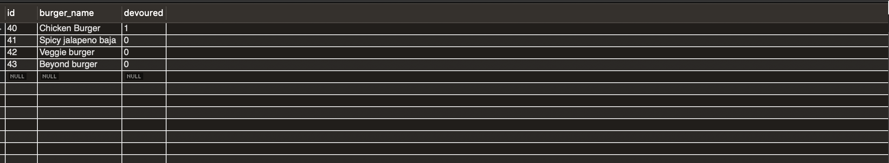

# Eat Da Burger 

This Application is a burger logger made with MySQL, Node, Express, Handlebars and a homemade ORM. Made following a MVC design pattern; using Node and MySQL to query and route data in the app, and Handlebars to generate the HTML.

## Technologies Used

* Model-View-Controller (MVC)
* Object Relational Mapping (ORM)
* Express.js
* HTTP Requests (GET, POST,PUT,DELETE)
* Routes and static content
* Handlebars engine integration
* Node.js
* Backend API calls
* Handlebars Templates and Layouts
* MySQL

## Table of Contents

1. [Installation](#Installation)
2. [Usage](#Usage)
3. [Contributing](#Contributing)
4. [License](#licence)


## Installation


 * Clone the repository to your local device
 * Install the necessary npm packages by typing in the following command in the terminal:

 ```
 npm install
 ```

## Usage

* Create and run a MySQL DB using the provided schema.
* This app is simple to run and is set up to use port 8080 for local running. Start the program in terminal with the code below:

```
node server.js 
```

* Another way to run this App is to, Navigate to [Heroku site](https://rocky-meadow-23943.herokuapp.com) and get started to use this Application. 
* This burger-eating app displays two different sections of burgers from our database; one section of burgers that have been eaten already(Devoured burgers) and one section of burgers that are ready to be eaten(Available burgers). 
* Each burger will have a button next to it so that you can eat those.
* The Devoured Burger can also be deleted from the Database by clicking the trash icon next to it.
* A user can also add burger of their own choice by typing into the input form and clicking the **Add burger** button.Then your new Burger is added to the Available burger section to devour.


## Contributing

Contributions are welcome. You can create an issue or submit a pull request.

## License

This Application uses the MIT License.

## Screenshots


